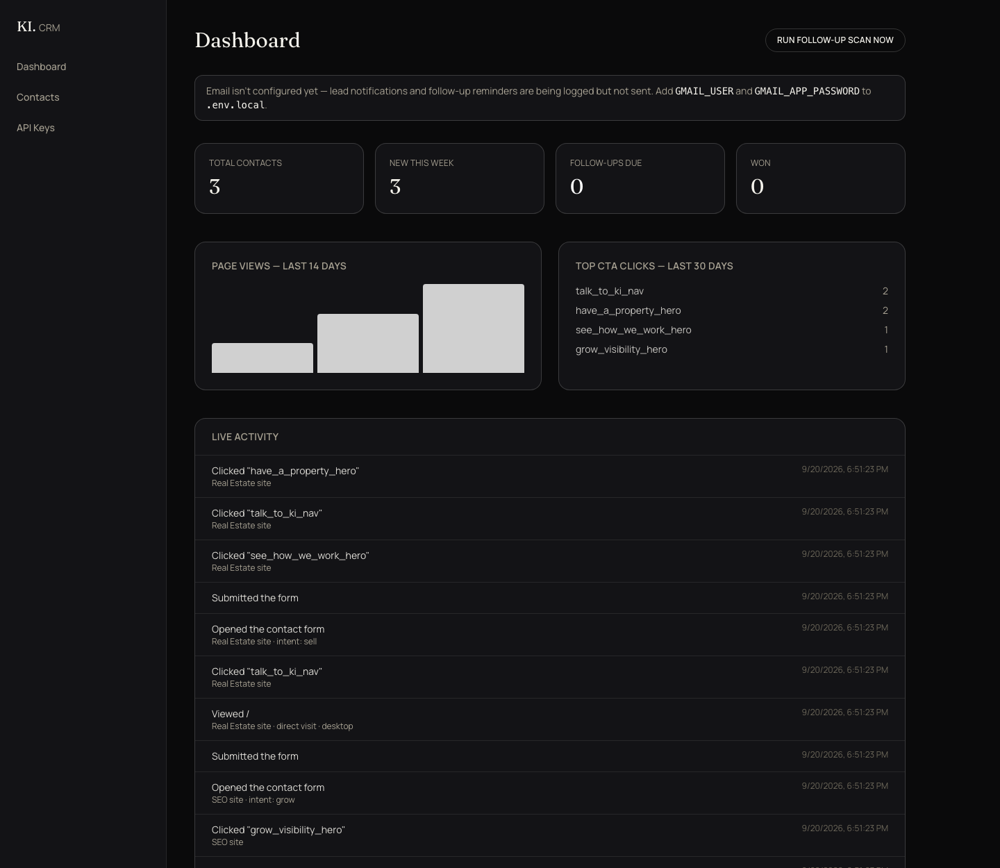
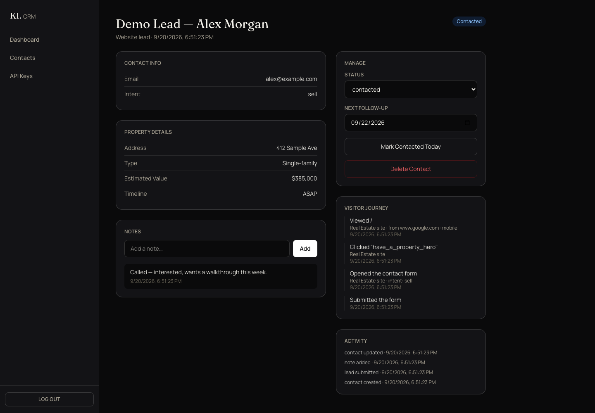
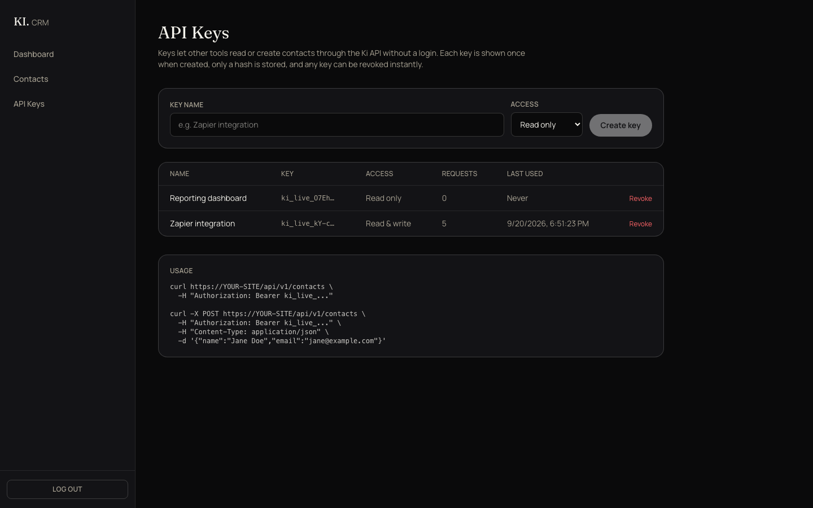

# Ki — Real Estate site + shared CRM

A full-stack Next.js application: the marketing site for **Ki Real Estate** and the **CRM / API backend** that also serves its companion site, [Ki SEO](https://github.com/Babyjupiter96/ki-seo).

Leads from both sites land in one Postgres-backed CRM with visitor analytics, follow-up reminders, and API-key-authenticated access.


## What's in here

**Marketing site**
- Next.js 16 (App Router), React, TypeScript, Tailwind CSS v4, Framer Motion
- Canvas-based animated hero, scroll reveals, and magnetic buttons (the canvas animation and CSS transitions honor `prefers-reduced-motion`)
- Multi-step lead form that branches by intent (sell a property / grow a business / both / other)
- SEO fundamentals: per-page metadata, Open Graph, canonical URLs, JSON-LD (`Organization`, `ProfessionalService`, `FAQPage`), `sitemap.xml`, `robots.txt`

**CRM (`/admin`)**
- Contacts with a status pipeline, notes, follow-up dates, and a full activity log
- Hourly follow-up scheduler that emails a reminder when a lead goes untouched
- Gmail SMTP notifications for new leads
- Manual contact entry, search, and filters

**First-party analytics**
- Page views, CTA clicks, and form-funnel steps, with referrer, device, and `utm_source`
- **Visitor journey:** when a visitor submits the form, their earlier anonymous activity is linked to the new contact, so each lead shows what they did before converting
- Live activity feed and 14-day traffic chart on the dashboard

**API keys**
- Create named keys with `read` or `read_write` scope; revoke instantly
- Keys are shown once at creation. Only a SHA-256 hash is stored
- Per-key request count and last-used timestamp
- Consumed through a versioned public API (`/api/v1`)



| Lead detail with visitor journey | API key management |
|---|---|
|  |  |

*CRM screenshots use seeded demo data.*

## Architecture

```
┌──────────────────┐        POST /api/lead, /api/track (CORS allowlist)
│  Ki SEO site     │ ─────────────────────────────────────────┐
│  (ki-seo repo)   │                                          ▼
└──────────────────┘                          ┌──────────────────────────────┐
                                              │  Ki Real Estate  (this repo)  │
┌──────────────────┐   POST /api/lead, ...    │  • marketing site             │
│  Browser         │ ───────────────────────▶ │  • public + admin API         │──▶ Postgres
└──────────────────┘                          │  • CRM UI  (/admin)           │
                                              │  • scheduler (node-cron)      │──▶ Gmail SMTP
┌──────────────────┐   Bearer ki_live_...     │                               │
│  External tool   │ ───────────────────────▶ │  /api/v1/*                    │
└──────────────────┘                          └──────────────────────────────┘
```

Two separate sites share **one** database and **one** admin dashboard. The SEO site has no backend of its own; it calls this app's API cross-origin.

## API

| Auth | Endpoint | Purpose |
|---|---|---|
| Public (CORS allowlist) | `POST /api/lead` | Submit a lead from the site form |
| Public (CORS allowlist) | `POST /api/track` | Record a page view / click / form step |
| API key (`read`) | `GET /api/v1/contacts` | List contacts (`status`, `intent`, `search`, `limit`, `offset`) |
| API key (`read`) | `GET /api/v1/contacts/:id` | Fetch one contact |
| API key (`read_write`) | `POST /api/v1/contacts` | Create a contact |
| Admin session | `/api/contacts/**`, `/api/analytics`, `/api/admin/**` | Powers the CRM UI |

```bash
curl https://YOUR-SITE/api/v1/contacts \
  -H "Authorization: Bearer ki_live_..."

curl -X POST https://YOUR-SITE/api/v1/contacts \
  -H "Authorization: Bearer ki_live_..." \
  -H "Content-Type: application/json" \
  -d '{"name":"Jane Doe","email":"jane@example.com"}'
```

Errors: `401` missing / invalid / revoked key, `403` read-only key used for a write.

## Getting started

Requires Node 20+ and a Postgres database.

```bash
createdb ki_dev
cp .env.example .env.local      # then fill in values
npm install
npm run dev -- -p 3002
```

Tables are created automatically on first query.

| Variable | Purpose |
|---|---|
| `DATABASE_URL` | Postgres connection string |
| `ADMIN_PASSWORD` | Password for `/admin/login` |
| `ADMIN_SESSION_SECRET` | Signs admin session cookies (`openssl rand -hex 32`) |
| `GMAIL_USER`, `GMAIL_APP_PASSWORD`, `NOTIFY_EMAIL` | Optional. Without them, emails are logged instead of sent |
| `NEXT_PUBLIC_SITE_URL` | This site's public URL |
| `NEXT_PUBLIC_SEO_URL` | The companion SEO site's URL (used for cross-links) |
| `ALLOWED_ORIGINS` | Comma-separated origins allowed to call `/api/lead` and `/api/track` |

`render.yaml` is included as a Render Blueprint (web service plus a managed Postgres database).

## Tests

```bash
npm test          # Vitest, no database or network needed
```

88 tests across auth (session tokens, expiry, tamper resistance), API keys (format, hash-only storage, scope and revocation rules), the CORS allowlist, email escaping, and the `/api/lead`, `/api/track`, and `/api/v1/contacts` handlers. The database layer is mocked, so the suite runs in well under a second and in CI without Postgres. GitHub Actions runs type-check, lint, and tests on every push.

## Design decisions

- **One backend for two sites.** A shared CRM avoids splitting leads across two dashboards. Cross-origin writes are restricted to an explicit `ALLOWED_ORIGINS` allowlist, and only the two public endpoints are exposed to it.
- **Postgres over SQLite.** The project started on SQLite and was migrated so it can deploy to a managed host. `pg` returns timestamps as strings so the rest of the code keeps a simple date model.
- **API keys are hashed with SHA-256, not bcrypt.** Keys are 192 bits of random data, so there is nothing to brute-force; a slow password hash adds cost without adding security. Lookup is a single indexed hash comparison. The plaintext is never stored and cannot be recovered.
- **Stateless admin sessions.** A signed, `httpOnly` cookie is verified with the Web Crypto API (HMAC-SHA-256, constant-time compare), so it works in Next.js's `proxy.ts` layer without a session table.
- **Scheduler runs in-process.** `node-cron` is registered from Next's `instrumentation` hook, which fits a long-lived Node host (Render, Fly, a VPS). On serverless platforms it would need to be replaced with a scheduled trigger hitting an endpoint.
- **Analytics are first-party and anonymous until a form is submitted.** A random browser ID links pre-conversion activity to a lead only once the visitor volunteers their details.

## Known limitations

- Tests cover the pure logic and the public API handlers (88 unit tests); there are no database-backed integration tests or browser end-to-end tests yet
- No rate limiting on the public endpoints
- A single shared admin password (no per-user accounts or roles)
- Session IDs are per-origin, so a visitor moving between the two sites appears as two sessions
- No cookie/consent banner; add one before using the tracking in regions that require it

## Tech

Next.js 16 · React · TypeScript · Tailwind CSS v4 · Framer Motion · PostgreSQL (`pg`) · Nodemailer · node-cron
